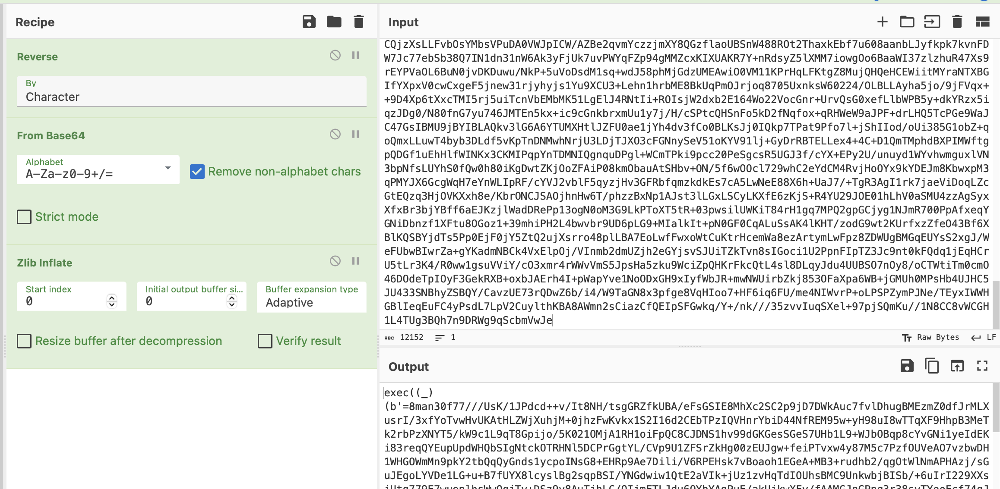

# Heked By

Description: 
Author: daffainfo

### Cara Solve

1) File mana yang mengandung suatu malware


**Jawaban**: Didalam folder `/root/` terdapat repository `flask-api-rest` yang dimana didalam file `setup.py` terdapat malicious code

2) Folder mana yang diencrypt oleh malware


**Jawaban**: Jika dicek satu-persatu folder yang ada, didalem folder `/tmp` terdapat file yang terencrypt beserta notes dari threat actor

3) File apa saja yang sudah terkena malware, berikan nama file sebelum terkena encrypt

**Jawaban**: Dengan menggunakan gambar diatas, terlihat ada 1 file bernama `whut.txt.lalala` yang sebelumnya file tersebut memiliki nama `whut.txt` (`.lalala` adalah extensi setelah diencrypt oleh suatu malware)

4) Berikan address BTC yang digunakan threat actor untuk memalak victim

**Jawaban**: Bisa didapatkan dengan membuka note yang diberikan oleh threat actor

```
Your system has been encrypted HAHAHAHAHA!!!
Send me 100 BTC first to 1AvnuhyVYDbT8J7iucgvW3A3ANNa9UHYTc to unlock the files
```

5) Berikan email yang digunakan threat actor


**Jawaban**: Karena malicious code tersebut ditaruh didalam repository `flask-api-rest`, maka kita bisa lihat emailnya dengan menggunakan command `git log -a`

6) Berikan link yang digunakan threat actor untuk mendownload malware

**Jawaban**: Hal ini bisa didapat dari mendecode malicious code yang ada di file `setup.py` (Reverse string -> decode base64 -> zlib inflate)



Ulangi langkah diatas sampai ketemu suatu command untuk mendownload file binary


7) Sebutkan key yang digunakan threat actor untuk melakukan encrypt data

**Jawaban**: Binary malware tersebut akan melakukan fungsi xor secara rekursif pada folder `/tmp`. Dan untuk melakukan xor tersebut threat actor tersebut menaruh keynya didalam binary tersebut (Dan hal tersebut bisa didapatkan dengan menggunakan strings / decompile binarynya)


Keynya adalah `Awikwok531921`

8) Apa isi dari file yang telah diencrypt? Masukkan stringnya

Xor kembali file `whut.txt.lalala` untuk melihat isi file sebelum terkena malware

