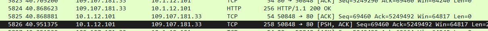

# Sussy Bakaware

Description: You are been hired as a blue team engineer on company, for your first joob you need investigate a new malware that has been infected some user, your lead team said 10 questions should be enough for you. Good luck for your first job

Author: abdieryy

## How to Solve

1. What the IP and DNS that host the malware? (ip_domain)

Terdapat sebuah traffic seperti ini yang responsenya adalah file zip yang dicurigai sebagai malware


Bila dilihat dari network miner atau wireshark akan terlihat ip dari domain tersebut


`46.4.205.200_mimsmehediclub.com`

2. IP Address that has been infected?

Dari traffic di atas kita bisa melihat destinasi ip yang dituju


`10.1.12.101`

3. What is the request token when the malware initiated the connection to the CnC?

Kita dapat melakukan filter `frame contains "token"`


`f960cc969e79d7b100652712b439978f789705156b5a554db3acca13cb298050efa268fb`

4. The filename of malware? (xxx.xxxx.redacted_xxxx.ext)

Kita dapat melihat dari network miner


`att.file.downloaded_1914.zip`

5. Arrival or timestamp of malware? (UTC Format, YYYY-MM-DD HH-MM-SS UTC)

Kita dapat melihat dari network miner


`2024-01-12 20:34:43 UTC`

6. Malware family labels? (format: lowercase, fam1_fam2)

Upload file zip tersebut ke [virustotal](virustotal.com)


`calisto_sload` atau `sload_calisto`

7. SHA-256 of malware?

Dapat ditemukan melalui [virustotal](virustotal.com)


`7acaa1011452c0d1a72dd162a8d78e07fbe0cce56276a937eacff119aa39da83`

8. What the computer name of victim? (xxxxxxx-xxxxxPC)

Saat melihat pada tab files network miner, terdapat sebuah file yang bila dibuka adalah base64


`DESKTOP-WIN11PC`

9. What the frame number of the stealer capture the desktop victim?

Saat melihat pada tab files network miner, terdapat sebuah file yang bila dibuka adalah base64 dan saat di decode adalah sebuah gambar


Kita dapat melihat di network miner pada packet berapa file tersebut berada 


Namun response yang benar adalah packet diatasnya



`5824`

10. What the function name that has loaded command for the malware?

Pada saat kamu membuka file pada zip, kamu akan mendapatkan sebuah file js

Dan lakukan obfuscate dan mendapatkan sebuah function


`_0x3cef`

Apabila telah menjawab semua pertanyaan, maka akan mendapatkan flag


```
ARA5{1t5_4ll_4b0ut_4tt3nt10n_th3_M4lW4r3_1nv3st1g4t0r_0x69a221}
```