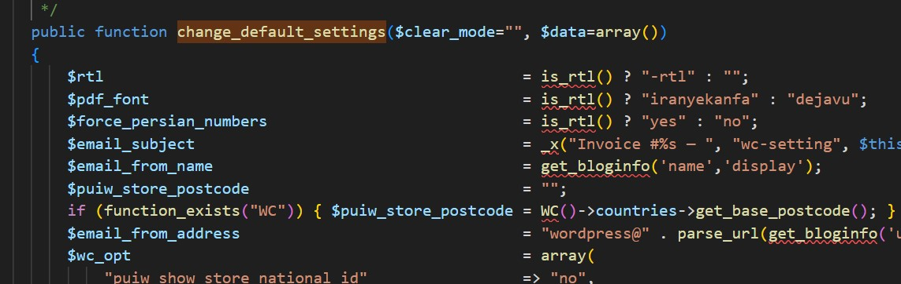

# WongPsugih breach

Description :  
 	
"WongPsugih sajane mung xawang xinawang"

anyway please leak the WongPsugih website because he's not xawang xinawang

Author : abdieryy

## How to Solve

Pertama kita akan mendapatkan seperti ini 


sesuai dengan hint, kita diminta membandingkan dengan folder yg ada dengan zip

singkat cerita kita mendapatkan perbedaan di plugins `pepro-ultimate-invoice`

`Original file` dari zip



`Edited file` dari folder yang sudah ada


Kita bisa melihat adanya require_once `pdfmargin.php` namun pada saat dilihat pada folder `pepro-ultimate-invoice` tidak ditemukan adanya file `pdfmargin.php`


Lalu bisa kalian track kalau function tersebut ada pada kode dibawah


Cara gampangnya adalah, kalian dapat melakukan deploy wordpress di localhost kemudian masukan folder plugin tersebut dan melakukan mencoba fitur yang ada 

Jika kamu lakukan deploy maka akan error seperti ini


Kita tinggal membuat file dengan nama `pdfmargin.php`


Lalu kita check setting yang ada di plugins, karena sesuai dengan kode diatas adalah melakukan export PHP 


Lalu kita buka dengan url `/wp-admin/?ultimate-invoice-get`


Maka file yg tadi kita buat akan tampil pada endpoint tersebut, sisanya copy endpoint dan paste ke we target


Kita mendapatkan flag pertama, untuk selanjutnya kita dapat melakukan dorking pada setiap plugin relevan seperti ini 


Sesuai dengan referensei [Patchstack](https://patchstack.com/database/vulnerability/simple-staff-list/wordpress-simple-staff-list-plugin-2-2-4-broken-access-control-vulnerability), bahwa untuk melakukan poc tersebut harus dengan user privilege `subscriber`

Buat akan terlebih dahulu kemudian buat request seperti ini 


Dan kita mendapatkan respon dalam bentuk `csv`


Setelah kita buka maka kita mendapatkan flag


```
ARA5{Ju5t_L34k_4nD_d0n3_it_0x1337WPn0tx1n4w4n9}
```